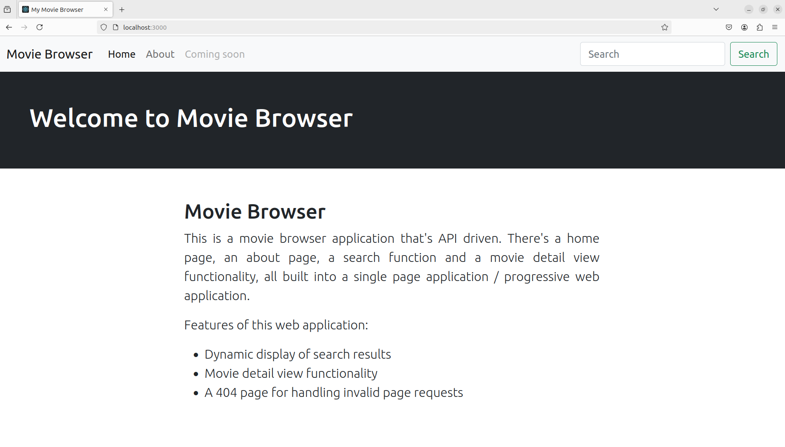
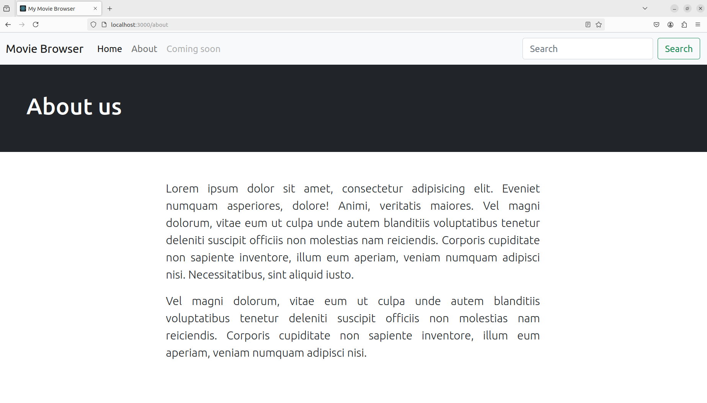
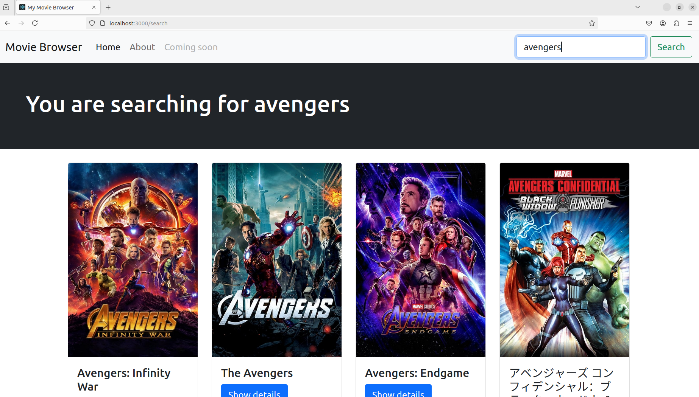
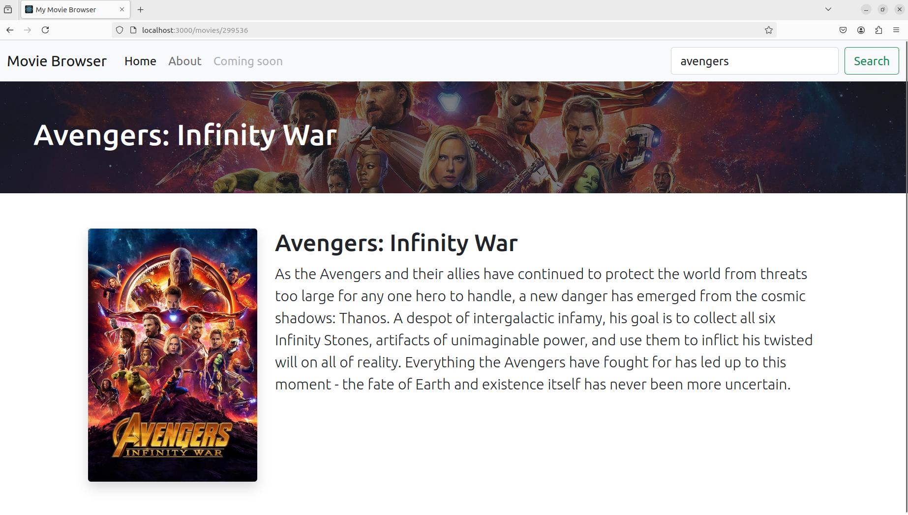
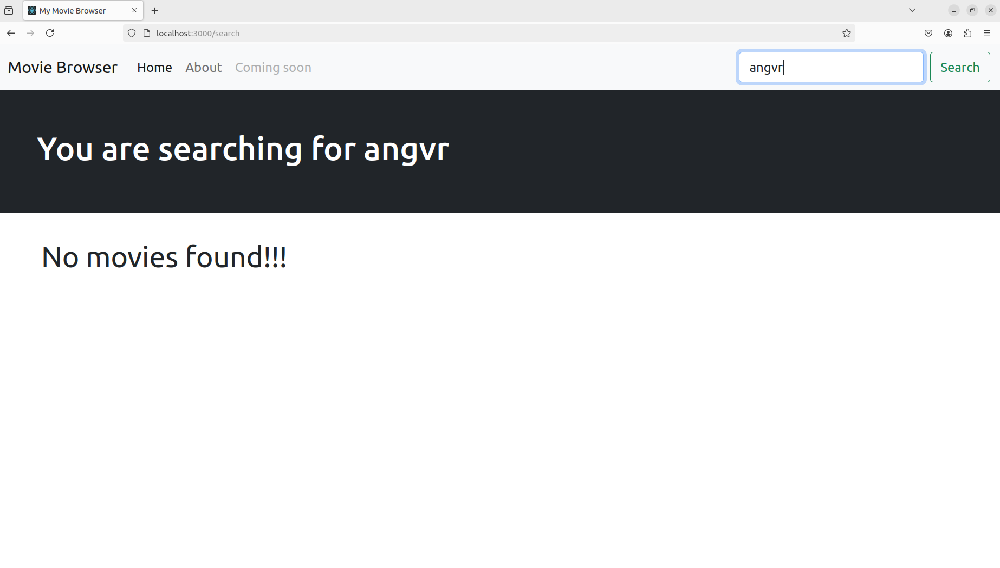

## Description

--> Designed an API based movie browser app called "My Movie Browser" using React, JavaScript, HTML and CSS.

--> The website has 2 static pages "Home" and "About" which can be accessed from the navigation bar.

--> When the user starts typing a string in the search box, related movie results start getting displayed dynamically after each keystroke.

--> The movie data is fetched from https://api.themoviedb.org/ through API calls.

--> Upon clicking the "Show Details" button of a particular movie in the search results, the poster image, the backdrop image and the overview of the movie is also shown to the user in a separate page.

## UI Snapshots
## Snapshot1

## Snapshot2

## Snapshot3

## Snapshot4

## Snapshot5

